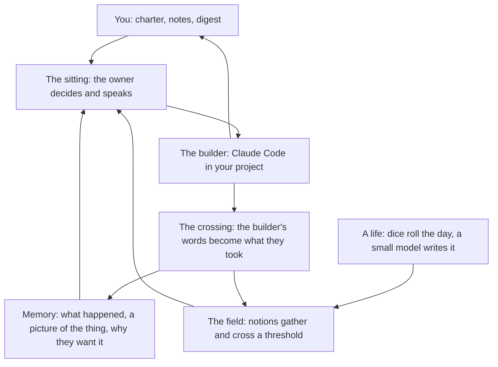
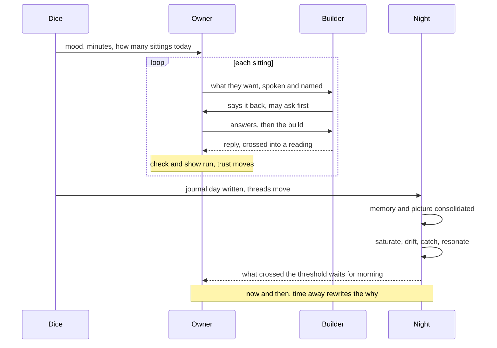

# Regent

**regent** (n.): someone who governs in place of a sovereign who is absent.

Regent is a harness that gives a software project a simulated owner. You write
a short charter and go away. A cast character, a person with a life, moods, a
memory that loses things and nights that turn things over, looks after the
project in your place for days or weeks of simulated time, directing Claude
Code as the builder. You come back to a project that has grown, a digest of
every decision with its reason, and a page where you can watch the whole run.

The owner is not a reviewer and never reads code. They say what they want, use
the thing, question what comes back, set limits, change their mind, and think
of things nobody asked for. They are deliberately far from software: a retired
dairy farmer, a lock keeper, a school bursar. That distance is the point. An
owner who thinks like the builder asks for what the builder would have built
anyway.

Regent is experimental. It is one Python file and one HTML page, with no
dependencies beyond the `claude` CLI. At the start of every run it prints what
it read from the charter, and every line it could not read, because the run is
days long and you will not be there.

## Why a person, and not a prompt

A long-running agent with no owner drifts toward polishing what already exists.
A language model told to play an owner drifts toward the register of whatever
it reads: within a dozen exchanges a "farmer" is dictating shell commands and
test names, and from then on it is a second engineer reviewing the first.

What the harness adds is only what a person has and a prompt does not:

- **A life that goes on without the project.** Dice decide the day; a separate
  model writes it. Most of the owner's attention is elsewhere, as it would be.
- **Perception.** Nothing the builder writes reaches the owner raw. It arrives
  as what they took from it, in the time they had, in words they own.
- **Memory that forgets**, and an understanding of the thing that builds slowly.
- **Thoughts that arrive.** Nothing is asked for on the spot. Notions gather
  under notice, fed from the owner's life and from the work, and cross into the
  open when they have gathered enough.
- **Reasons that move.** Why the owner wants the thing is rewritten as they
  use it, and the project is steered by the current reason.

Each of these is a separate stage with a narrow channel to the next, and most
stages are a different model call from the owner. The layering is the design: a
persona is kept stable by controlling what each stage is shown, not by telling
it who it is.

## Quick start

Requirements: Python 3.11 or later, and the
[Claude Code](https://docs.anthropic.com/en/docs/claude-code) CLI (`claude`) on
your PATH and signed in.

```
uv tool install -e .          # or: pip install -e .

regent cast --pin "a lock keeper" --pin "cannot leave a loose end"
mkdir -p ~/code/thing/.regent
cp examples/linkcheck.md ~/code/thing/.regent/charter.md     # then edit it
regent run --project ~/code/thing --owner <name> --watch
```

`cast` prints the name of the owner it made. `run` starts the run and, with
`--watch`, opens the live page. Re-running the same command resumes an
unfinished run at its next day; `--new` starts over.

**Before you run it on anything you care about:**

- The builder is Claude Code with permission to edit, run and commit inside the
  project directory. Point it at a git repository, ideally a branch or a
  worktree.
- Both the owner and the builder work inside Claude Code's sandbox. A shell can
  write only inside the project and reach only the domains the charter lists
  under `## Network`. No Network section means no network.
- A run spends real money on model calls. As a guide, a twenty-day run at
  about one sitting a day has cost 40 to 75 US dollars and taken two to three
  hours, nearly all of it the builder's turns. Start with `--days 3`.

## The architecture



Each box is a layer with its own model calls, and each arrow is a narrow
channel: nothing crosses it unchanged. The builder's words never reach the
sitting except as what the owner took from them; the night never reaches the
sitting except as a notion that gathered enough to arrive.



A turn is a **sitting**: one decision by the owner, then one turn by the
builder. Everything else exists to decide what the owner is shown when they
sit down, and nothing else stands between the owner and Claude Code.

### A life

The unit is a day, with a weekday and a place in the year. Dice decide how the
day went, how many sittings the project gets (a Poisson draw, often none) and
how long each is (lognormal, bent by how thorough the owner is and how far they
trust the builder). A separate small model writes the journal entry from what
the dice rolled: two draws from a table of things that happen in *this person's*
weeks, each with its own rolled turn for better or worse; now and then one of
their pursuits, the things they do because they want to; and at most a quarter
of it about the project, in their words. The writer is given the owner's
disposition as things a person does, because a journal that says someone is
curious is not a journal. The owner is never asked to write their own life: a
model writing its own life unaided writes the same mild day forever.

**Threads are state, not prose.** What is hanging over the owner lives as rows
in their life, seeded from their bible and continuous across every project they
govern. Each day a hazard on the days since it last moved picks one thread, so
the neglected one comes due and none can hold the journal for a fortnight, and
the dice roll what happens to it: it moves on, it turns into something else, it
goes against them, or it ends. Often a second thread comes up because of the
first, since saying one thing out loud puts a person in mind of another; it is
only thought about, and may stand where it stood. The writer is handed those
one or two, told the rest are not in today's entry, and hands back where each
stands now. An ending the writer will not write did not happen: the thread
drags on and comes round riper. New threads open out of a day that started
something, or out of a tension the night found.

### The crossing

Nothing the builder writes reaches the owner as it was written. A small model
that is not the owner reads it in the minutes the owner has, knowing what they
already understand, and what comes back is what they *took*: the meaning, what
they did not follow, what they did not get to. Only that reading goes further,
into their context, their memory and their nights. The raw text stays in the
ledger for the watch page.

Drift toward the builder's language becomes learning at a human rate: a word of
the trade that a reading explained well enough is kept, on a draw loaded by
curiosity, and then it is theirs.

In the other direction the owner *speaks*. The message is framed as said aloud
to someone doing a job in their yard, with breath for a number of words set by
their minutes, and nobody says a file name or a command out loud. They do not
write requirements. They name what they want in a few words of their own, and
before anything is built the builder says each one back as a precise
requirement with how it would prove it, and asks what it cannot settle by
reading the project. The owner answers standing there and says what has been
taken wrong. The harness keeps both faces of every requirement: the owner's
words and the builder's specification.

A sitting is a stretch of the owner's time, and with an hour a person goes
back and forth. The builder may stop part-way when the owner's word would
change what it does next, a choice it cannot settle, something surprising, a
first version worth seeing, and report. If the owner's minutes allow, they
answer standing there and the builder goes on, up to `--exchanges` times a
sitting (four by default); with a few minutes they do not, and the builder
finishes as best it can.

Every sitting the harness measures the share of the owner's words that came
from the builder and appear nowhere in their life. It is on the watch page as a
chart. Without the crossing it climbs steadily; with it, it stays low and flat.

### Memory, and a picture of the thing

Each night the record of the project is rewritten as what a person would
remember of it, and parts go. It is written from the readings, never from what
the builder said. Now and then the builder is replaced by a fresh one who gets
only that memory.

The memory is what happened. The **picture** is what the owner takes the thing
to be: its parts, each by what it does for somebody and sometimes by what it is
like in their own life, because that is how a person holds a thing they cannot
open. It changes slowly. With it come a few **gaps**: what they know they do
not understand and that decides what the thing should do or become, never how
the code works. The owner governs from the picture, can put the gaps to the
builder, and the gaps feed the field.

### The night

Nobody dreams on request, so the owner is never asked to. The night is separate
runs:

| | model | reads | does |
| --- | --- | --- | --- |
| Saturate | haiku | why they want it, the project as they hold it, recent days | extracts motifs, tensions, questions. Answers nothing |
| Drift | sonnet and haiku in parallel, over different random days | the motifs, the project as they hold it, their bible, journal days drawn at random with old ones never impossible | links things nobody would file together. Every link anchors in the project and reaches into their life or anything the model knows. Mechanism over imagery |
| Catch | code | the links, in order | the falling spoon: a link that let go of the project is a miss, each miss in a row loosens the grip, and when it drops the pass is over |

What a link may anchor in is the project as the *owner* holds it: why they want
it, where they think it could go and what follows from that, each thing they
have asked for under their own name for it, each thing they did not follow, and
each doubt they have not answered. The caught links do not become ideas. They
feed the field.

### The field

Thoughts arrive; they are not requested. Under the owner's notice is a field of
**notions**, each a few words: a mechanism, a tension, an absence, a
possibility, never a proposal. Everything that reaches the owner feeds it: the
day's journal entry, what they took from the builder and what they did not
follow, what the thing printed when it was used, the links the night caught,
something you said to them, the gaps in their picture, and their own answers to
their own doubts. A small run that judges nothing reads new material against
what is already stirring and says only what feeds what.

The rest is arithmetic, in code. A feed adds its strength, and is worth more
from a source that has not fed that notion before, because the same thing
arriving from somewhere else is worth more than one place saying it twice. The
first time a notion is fed from both the owner's life and the project it gets a
lift, because carrying the one onto the other is what the owner is for. Every
night everything leaks, and what is faint and unfed is gone.

A notion crosses when it has gathered enough. The threshold belongs to the
owner: curiosity and restlessness lower it, patience raises it, sleep lowers
it, and each arrival raises it for some nights after so that arrivals are
spaced. One crosses at a time.

Then it is said, once, by **Sift**: a fresh context handed one notion and
everything that ever fed it, shuffled and anonymous, together with the intent,
the owner's reason, what they have already answered and their taste record. It
says the notion in the owner's plain words, with why it might be wrong, or says
nothing and the notion sinks back. What arrives is one of four kinds:

- an **ask**: a thing to build, small enough for one go, with how they would
  notice it working;
- a **doubt**: a question about why this is wanted or who it is for, which only
  the owner can answer;
- a **wish**: what the thing could become, bigger than one build;
- a **worry**: what follows if it works and gets used, including harm that only
  arrives because it works.

It reaches the owner on waking, at the desk in the middle of a sitting, or on a
day they gave the project no time. They meet it not knowing where it came from.
An ask is taken by naming it as something they want. A wish is taken as a
direction to steer by, told to the builder once, and is not work yet; it goes on
gathering in the field and can arrive again later as its first small ask. A
doubt or a worry is answered in their own words. Anything can be turned down,
and that is the gate: declined for good, it goes on a taste record that Sift
reads, so it is not brought twice; set aside as "not now", it stays off the
record, because that is about the day and not the idea. Every one ends with a
reason in the digest, so a declined idea you still want is yours to act on.

### Time away from it

Now and then the owner is not at the desk at all, and this is when the reason
gets turned over. They are given why they wanted the thing and every earlier
version of that, their picture of it and its gaps, days drawn from their
journal, what they have made of the builder lately and what they have answered
for themselves, and only last the counters of how the work is going. What comes
back is why they want it *now*, what it could become beyond anything asked for,
and what follows if it works. The new reason is written into their life, so the
next sitting belongs to the person who wants that, and the builder is told once
that it moved. Every version is kept.

### When it stops surprising them

A sitting is the same as the last when the owner wanted nothing new, took and
answered nothing, and the thing looked as it looked before. Sameness, as a
running average, already cuts the sittings a project gets. It also does the
other thing boredom does. When the work has gone stale, the check passes and
the builder is trusted, a draw loaded by boldness, restlessness and curiosity
turns the sitting into a **push**: checking is declared the builder's job from
here, and the time goes on what this is for and what it could become. The owner
may ask the builder what it would build next if the thing were its own.
Separately, trust sets the altitude: a trusted builder keeps the proof and the
owner's attention is sent higher; an untrusted one is asked for proof.

Trust is earned and lost on what the owner sees every sitting: the check
passing or failing, a thing they saw working, a thing the builder said back
wrong, a thing they asked for that has not come after a few sittings, and,
weightiest of all, whether the thing matched what they were told the few times
they tried it themselves.

### You are away

That is why the project is theirs. You are there for the charter's **Reserved**
decisions and nothing else, and a run never waits on you. When the owner cannot
tell what the thing is for, who it is really for or how far it should go, they
work it out from the charter, from what they have seen and from their own
sense, decide, and say what they decided and why where you can read it later.
Making the purpose larger and better than it was written is the job. When it is
the thing itself they do not follow, they ask the builder: some sittings open
with the owner asking where the work is up to and what the builder took for
granted, and an assumption that does not hold is theirs to act on in the same
sitting.

### Nothing runs on a count

Sittings, their length, whether the owner tries the thing themselves, when the
spoon falls, when they take time away, when a fresh builder takes over: each is
a draw from a distribution or a hazard that grows with the time since it last
happened, tilted by disposition. A curious owner dreams more often; a patient
one goes longer between hours away.

## The charter

The charter is `<project>/.regent/charter.md` unless you pass another path: a
markdown file whose `##` headings the harness reads. `examples/linkcheck.md` is
a worked one.

| Heading | What it is |
| --- | --- |
| Intent | What is to be built and who it is for. The builder is given this verbatim, because the owner never names a file |
| Constraints | The starting shape of the thing. The owner may change one, recording why |
| Refusals | Never crossed, by the owner or the builder |
| Reserved | Decisions that are yours alone. The owner asks, and the work carries on |
| Budget | `days:` and `turns_per_day:` |
| Tools | Commands the owner may run when trying the thing |
| Network | Domains a shell may reach, one per `-` line. Absent means none |
| Check | One shell command run after every sitting. Its exit code is pass or fail |
| Show | One shell command that uses the thing. This is how the owner sees it work, so it prints whole: no `tail`, no `head`. The harness keeps the last 300 lines and says so when it cuts |
| Stop | When the run is finished, in words. The owner reads it and can call the run done early; the harness stops when the check agrees |

## Commands

```
regent cast --pin "a lock keeper" --dial bold=0.6     roll a new owner
regent run --project DIR --owner NAME [--days N] [--turns-per-day X] [--watch] [--new]
regent watch [PROJECT] [--export FILE]                 the live page, or one file with the run inside
regent say RUN_DIR "stop adding flags, I want it faster"
regent plant RUN_DIR "a story about a bridge that was measured twice"
regent journal NAME --last 10                          their days, then every thread and where it stands
```

`cast` rolls the dials (bold, curious, patient, trusting, thorough, stubborn,
restless) from a normal draw, an age, and seven dictionary words that must turn
up in the person's life; then a model writes the person who fits, the table of
things that happen in their weeks, and the things they do because they want to.
`--pin` fixes a fact in words and `--dial` sets a dial.

**Casting for the project.** A toy project can be any owner's side project, and
a randomly cast one is the more interesting for it. A substantial project wants
an owner cast for it, and the pins are where that happens. Three things to pin:

- **The domain, not the software.** The owner should be the person the Intent
  says the thing is for, or their stand-in, with lived experience of the
  problem: `--pin "ran a district hospital's rosters for twenty years"`. Their
  reason for wanting it then comes out of real use, and their asks, doubts and
  worries are the ones a real owner would have. The rule is far from software,
  not far from the problem.
- **Responsibility in their history.** Someone who has been answerable for a
  thing that could go wrong: a harbourmaster, a bursar, a ward sister, a farm
  manager. Such people already delegate, verify by outcome, keep a reserved
  list in their heads and say no, and it shows in how they treat the builder.
- **Dials.** For a project with consequences, `--dial thorough=0.6
  stubborn=0.5 trusting=-0.4`, and bold at least middling. A patient, trusting
  owner accepts summaries; the runs so far got most of their value from an
  owner who would not.

The owner never reads code. Their second opinion is the builder's independent
reviewer: when they ask for the code examined, for awkward cases tried, or
whether what they have been told is true, the builder puts an adversarial
subagent on it, one that has not seen the work in progress and is told to
break the thing and disprove the claims, and hands the owner its findings in
its own words. An owner cast with low trust asks for that often, and should.

`--days` is how long the run lasts in the owner's life and `--turns-per-day` is
the mean sittings a day, so `0.5` is every other day. `--dream-gap` is the mean
nights between spoon cycles. `--model` and `--regent-model` choose the builder's
and the owner's models.

`say` is from you and the owner knows it. `plant` is something they come
across, and they never learn it was you.

The CLI tells every model today's date, your email and the machine it runs on.
With an API key in the environment, the owner's and the night's calls run
`--bare`, Claude Code's own way of leaving that out. On a login there is no
such way, and one sentence in their prompts tells them it is the machinery's
and not theirs. The builder's calls go direct either way.

## Watching a run

One page, `watch.html`, read from the run's ledger every three seconds: what is
happening now and the builder's tool uses as they land; each day's journal with
the threads that moved; each sitting with what the owner said, what came back
and what they took from it; each read-back; each night with the spoon cycle
laid out; what is stirring in the field and what fed it; what arrived, where,
and what the owner did with it; how they understand the thing; why they want it
and how that moved; the words they have picked up; the share of their words
that are the builder's; requirements asked and built; the project's lines by
commit; and the spend. `--export` writes the same page as a single file that
needs no server.

When a run ends, `digest.md` in the run directory is the page to read first.

## Where things live

```
regent/
  regent.py                  the harness, one file
  watch.html                 the live page
  examples/                  worked charters
  owners/<name>/             a sample owner: bible.md, disposition.json, events.md, pursuits.md

~/.regent/                   or $REGENT_HOME
  owners/<name>/             owners you cast, each with life.db
  runs/<project>-<stamp>/
    run.db                   ledger and resumable state
    digest.md                what happened, and why
```

An owner is a folder you can copy, to another machine or to point a different
regent at a project. Their life is one SQLite file, continuous across every
project they govern, with their threads and their taste record. What they
remember of a project, how they understand it and why they want it are kept per
project, so a new owner on an old project starts with no memory of it.

## Limitations

- It is experimental, and tuned on a handful of runs. The constants of the
  field were set against the traffic of real runs, not derived.
- A convincing voice can make a mediocre idea sound wise. Read the wishes and
  worries in the digest critically; the owner's taste is simulated.
- The model provider's content filters occasionally refuse a night stage whose
  material, drawn from the owner's life, resembles a restricted topic (a
  beekeeper's journal is full of queens, colonies and disease). The harness logs
  it, the notion sinks back, and the run carries on.
- Cost scales with the builder's session. Long runs on large projects are not
  cheap.

## A note on scope

The first version of this was 10,914 lines of source, 7,670 of tests, 1,758 of
prompts, a 592-line config holding 224 tunables, 17 model roles each with its
own prompt and schema, three storage layers, and a hand-rolled wire protocol
propped up by a plugin skill. It worked. Nobody could tune it.

It is now one file and one page, because almost everything else it did is
something Claude Code already does: sessions, subagents, permissions, the
sandbox, structured output. The harness's job is the owner, and the owner is a
life, a way of perceiving, a memory and the nights. Think of that before adding
a module.
